# BAI TAP-3

## Câu 1. Ở trên repo hiện tại, git config local username và email

> git config --local user.name "DuyKhanh"

> git config --local user.email "tranduykhanh15022000@gmail.com"

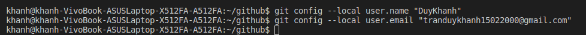

*** 

## Câu 2. Checkout master 1 branch là develop

> git checkout -b develop

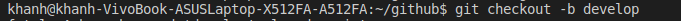

***

## Câu 3. Trên branch develop tạo 1 file demo.log, 1 file index.html với nội dung in ra dòng chữ “Hello world”. Làm thế nào để git không tracking tất cả file .log (dùng .gitignore). Sau đó tạo 1 commit add file index.html

tạo 1 file demo.log, 1 file index.html

> touch demo.log

> touch index.html

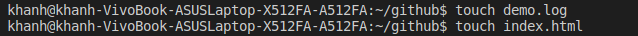

file index.html với nội dung in ra dòng chữ “Hello world”

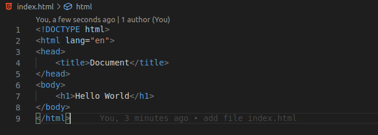

git không tracking tất cả file .log

> git rm -r --cache *.log

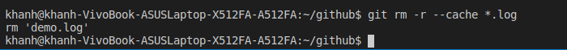

tạo 1 commit add file index.html

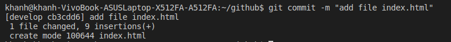

***

## Câu 4. Sửa đổi nội dung trên file index.html sau đó làm thế nào để revert lại file index.html trước khi sửa đổi không dùng undo mà dùng lệnh git. 

revert lại file index.html

> git revert HEAD 

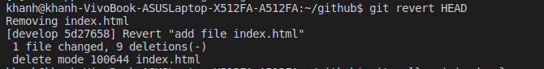

Sau đó chỉnh sửa lại nội dung

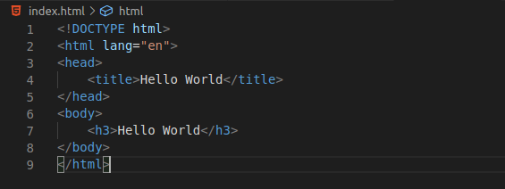

***

## Câu 5. Tạo 1 file demo.html với nội dung in ra dòng chưa “This is file demo”, tạo một commit mới add file demo.html và push code lên origin.

Tạo 1 file demo.html

> touch demo.html

nội dung in ra dòng chưa “This is file demo”

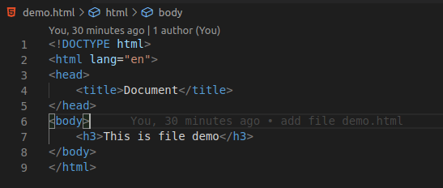

tạo một commit mới add file demo.html

> git commit -m "add file demo.html"

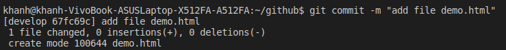

push code lên origin.

> git push origin develop

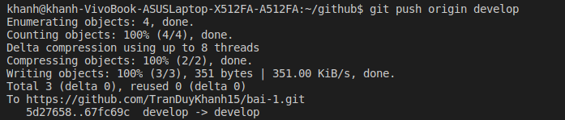

***

## Câu 6. Sửa đổi lại nội dung file demo.html với nội dung “This is a demo file” như không tạo thêm một commit mới nào cả chỉ là thay thế commit cũ và push lại code lên origin

Sửa đổi lại nội dung file demo.html với nội dung “This is a demo file”

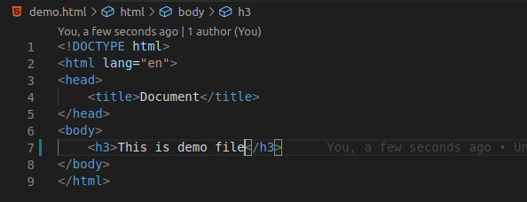

không tạo thêm một commit mới nào cả chỉ là thay thế commit cũ và push lại code lên origin

add file demo.html 

> add demo.html

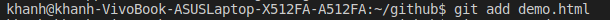

commit -- anmend để chỉnh sửa commit trước đó

> git commit --amend

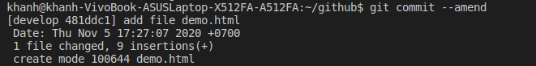

Push -f để ghi dè lên commit trước đó

> git push -f 

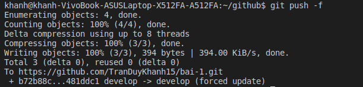
