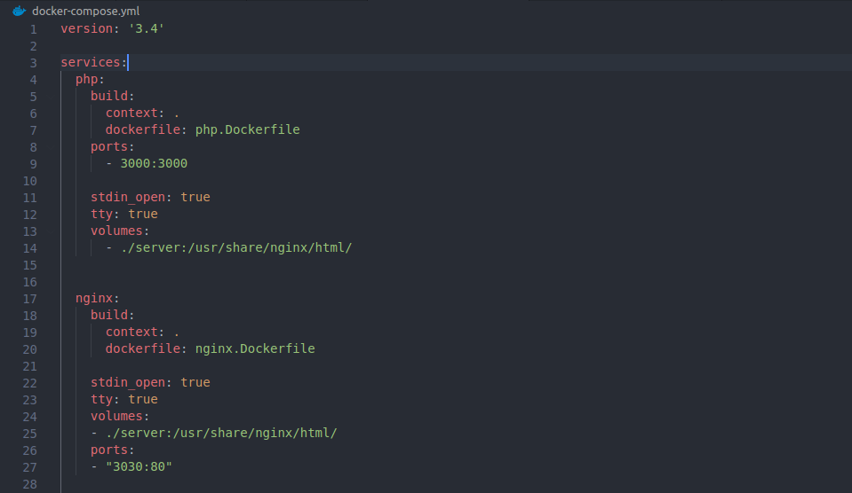
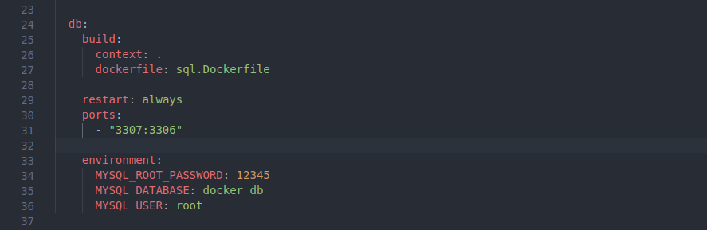
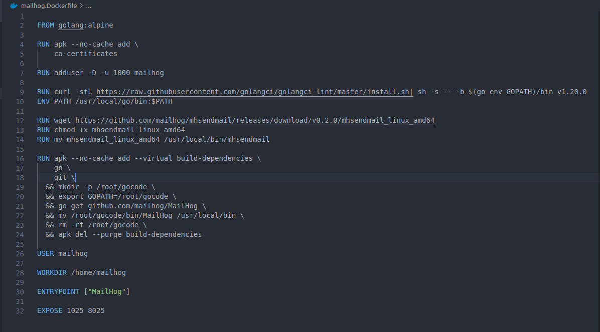

# bai-1
## Tạo 3 user: user-A, user-B, user-C và 2 group: Group-A và Group-B
Tạo 3 user:
* sudo useradd -m -c 'user-A' user-A
* sudo useradd -m -c 'user-B' user-B
* sudo useradd -m -c 'user-C' user-C

Tạo 2 Group:
* sudo groupadd Group-A
* sudo groupadd Group-B

## Cho user-A và user-B vào Group-A, user-C vào Group-B
Cho user-A và user-B vào Group-A:
* sudo usermod -a -G Group-A user-A
* sudo usermod -a -G Group-A user-B

Cho user-C vào Group-B:
* sudo usermod -a -G Group-B user-C

## Tạo 1 file example.txt với phân quyền user-A có read write exec, group-B chỉ có read và exec. Các user còn lại có thể read
Tạo file example.txt:
 * touch example.txt
 

Phân quyền:

1.Thêm user-A và Group-B vào example.txt:
 * sudo chown -R user-A:Group-B example.txt
 
2.Cấp phân quyền cho chúng:
 * sudo chmod -R 754 example.txt
 

## Upload và Download file thông qua ssh

Upload 1 file

* scp /home/khanh/text/download-test.txt vudang@192.168.0.7:/Users/vudang/Desktop/ssh-text

Download 1 file

* scp vudang@192.168.0.7:/Users/vudang/Desktop/ssh-text/download-test.txt text.txt

