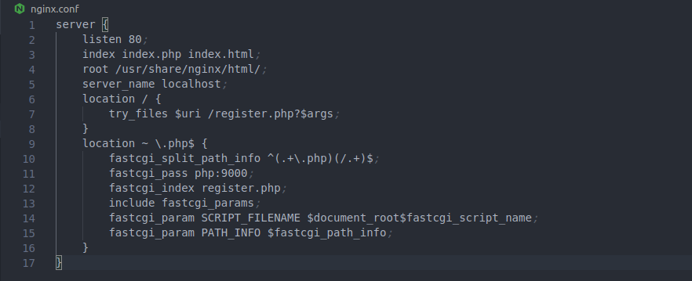
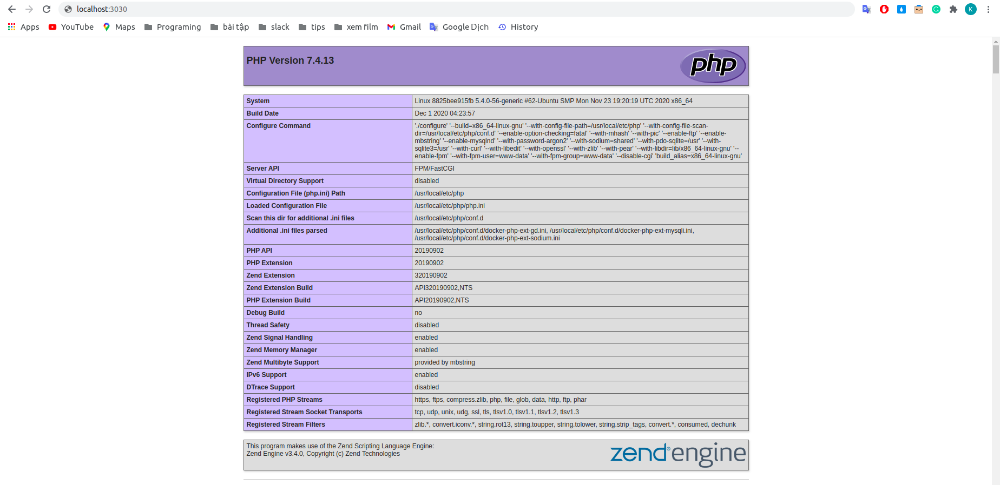
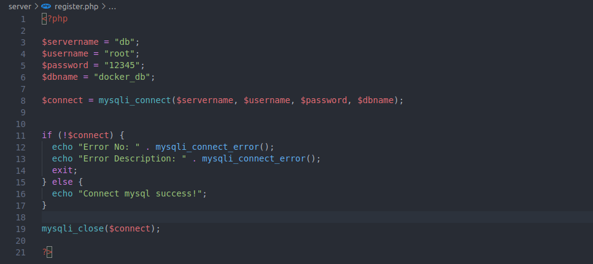
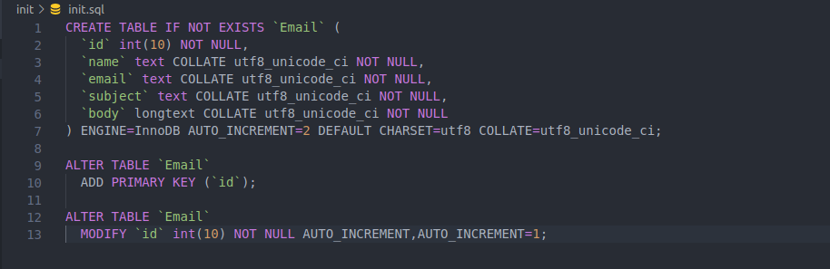

# BÀI TẬP DOCKER

## Câu 1. Build 1 service php (https://hub.docker.com/_/php), 1 serivce nginx (https://hub.docker.com/_/nginx) để cho thể show được trang php info lên web bằng docker

* Tạo file php.Dockerfile và nội dung.

> touch php.Dockerfile

* Tạo file nginx.Dockerfile và nội dung.

> touch nginx.Dockerfile

* Tạo file docker-compose.yml và thêm 2 service php và nginx vào.

> touch docker-compose.yml

* Tạo file nginx.conf và nội dung.

> touch nginx.conf

* Chạy lệnh docker-compose up --build để chạy docker.

> docker-compose up --build

* Truy cập localhost:3030 để kiểm tra.

*** 

## Câu 2. Thêm 1 service mysql (https://hub.docker.com/_/mysql), viết một chương trình php connect đến service mysql

* Tạo file sql.Dockerfile và nội dung.

> touch sql.Dockerfile

* Thêm service db vào file docker-compose.yml, tạo environment(môi trường) cho sql.

* Chỉnh sửa file php để kiểm tra kết nối với mysql.

***

## Câu 3. Thêm 1 service mailhog (https://hub.docker.com/r/mailhog/mailhog/), tạo một form có thể nhập nhiều email và sau đó submit  những email đã nhập vào 1 table và gửi  1 template mail giới thiệu về bản thân đến những email đó. Dùng mailhog để tổ chức làm server mail để testing

### Thêm 1 service mailhog và adminer.
* Tạo file mailhog.Dockerfile và nội dung.

> touch mailhog.Dockerfile

* Tạo file adminer.Dockerfile và nội dung.

> touch adminer.Dockerfile

* Thêm 2 service adminer và mailhog vào file docker-compose.yml.

### Tạo một form có thể nhập nhiều email.

* Chỉnh sửa file php.

### submit những email đã nhập vào 1 table và gửi 1 template mail giới thiệu về bản thân đến những email đó.

* Tạo Folder init, trong Folder init tạo 1 file init.sql để tạo bảng cho mysql

* Thêm volumes vào sevice db để kết nối file init.sql.

* Thêm đoạn jquery vào register.php để sử lý khi submit.

* Download PHPMailer để  gửi email.

> https://github.com/PHPMailer/PHPMailer/tree/master/src
 

* Tạo file sendEmail.php trong Folder server để sử lý.

* Thêm đoạn code để sử dụng PHPMailer.

* Thêm đoạn code để gửi nội dung tới email khác.

* Chúng ta lọc array bằng lệnh foreach, sau đó gửi danh sách email đã nhập lên adminer và mailhog.

### Kiểm tra 

* Nhập dữ liệu vào form và submit để kiểm tra.

* Vào mailhog để kiểm tra đã nhận được email chưa.

* Vào adminer để kiểm tra đã thêm email vào bảng chưa.

